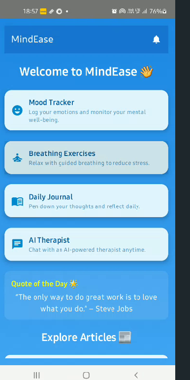
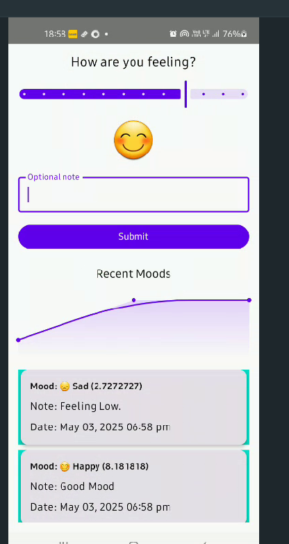
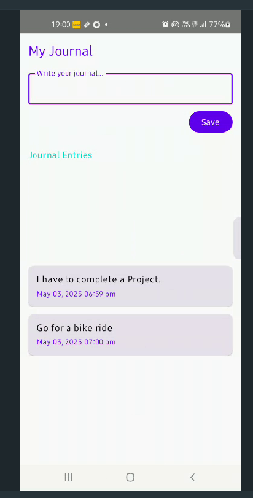
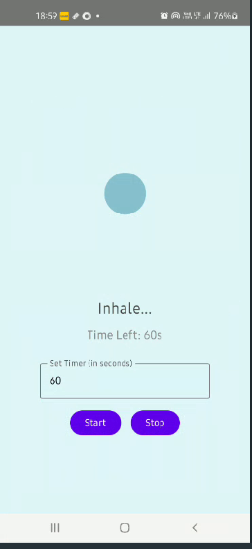

# Save the README content as a .md file for the user to push to their GitHub repo

readme_content = """
# 🧠 MindEase – Your Pocket Wellness Companion

MindEase is a Kotlin-based Android application designed to promote mental well-being. It offers users an easy way to track their mood, journal their thoughts, practice breathing exercises, and even chat with an AI-powered therapist.

## 🌟 Features

- **Mood Tracker** – Log your emotions and visualize your mood trends.
- **Breathing Exercises** – Guided breathing sessions to reduce stress.
- **Daily Journal** – Reflect daily with a personal journaling tool.
- **AI Therapist** – Chat with an AI chatbot for emotional support.
- **Wellness Articles** – Tips on mindfulness, productivity, and digital detox.

## 📸 Screenshots

| Home Screen | Mood Tracker | Journal | AI Therapist | Breathing |
|-------------|--------------|---------|--------------|-----------|
|  |  |  |  |  |

## 🛠️ Tech Stack

- **Language:** Kotlin
- **Framework:** Android SDK
- **Tools:** Android Studio, XML, Jetpack Components

## 🚀 Getting Started

### Prerequisites

- Android Studio Flamingo or later
- Android device or emulator
- Kotlin 1.8+

### How to Run

1. Clone this repository:
    ```bash
    git clone https://github.com/kartik417/AIMlApps.git
    ```
2. Open the project in Android Studio.
3. Build and run on an emulator or Android device.

## 📂 Project Structure

MindEase/
├── app/
│ ├── src/
│ │ ├── main/
│ │ │ ├── java/com/yourpackage/mindease/
│ │ │ ├── res/
│ │ │ └── AndroidManifest.xml
├── build.gradle
└── README.md


## 🙌 Contributing

Pull requests are welcome! For major changes, please open an issue first to discuss what you’d like to change.

## 📃 License

This project is licensed under the [MIT License](LICENSE).

## 💬 Connect

- 🔗 [LinkedIn](https://www.linkedin.com/in/kartik-sharma-5a220b31b/)
- 🔗 [GitHub](https://github.com/kartik417/AIMlApps)
"""

# Save to a file
file_path = "/mnt/data/README.md"
with open(file_path, "w") as file:
    file.write(readme_content)

file_path
